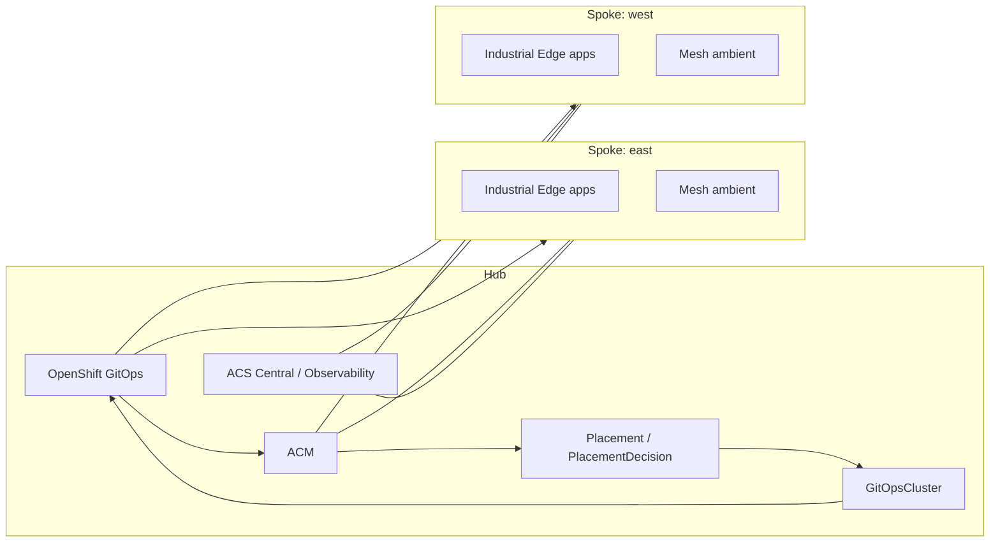
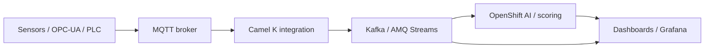
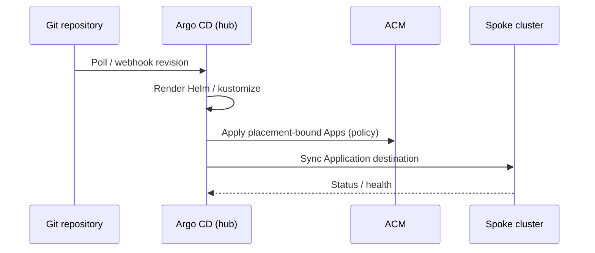

# Architecture

## Hub-spoke theory in multi-cluster Kubernetes

In multi-cluster Kubernetes, a **hub-spoke** model designates one administrative cluster (the **hub**) and one or more workload clusters (**spokes**). The hub owns fleet APIs: cluster inventory, policy placement, credentials for spoke registration, and often centralized GitOps controllers that fan out desired state.

Spokes remain the execution venues for application namespaces, data-plane components (Kafka, MQTT bridges, mesh dataplane), and regional isolation for latency, data residency, or blast-radius control.

## Why hub-spoke?

| Benefit | Description |
| --------|------------- |
| **Centralized management** | One control plane for membership, RBAC patterns, and bulk upgrades. |
| **Policy enforcement** | Kubernetes policies, compliance checks, and security baselines propagate from the hub. |
| **Observability** | Aggregated metrics, logging, and tracing strategies start at the hub and uniform dashboards span spokes. |
| **GitOps consistency** | A single Git revision strategy (with branch or overlay variants) drives spoke drift correction. |

## Components on the hub vs spokes

| Area | Hub | Spokes |
| -----|-----|--------|
| ACM hub operator & APIs | ✓ | |
| Argo CD / App-of-Apps root | ✓ (typical) | optional agents |
| ACS Central | ✓ | |
| ACS Secured Cluster | | ✓ |
| Developer Hub | ✓ | |
| Industrial Edge factories / MQTT edge | | ✓ |
| Kafka brokers (regional) | optional | ✓ |
| Service Mesh ambient / ztunnel | control | ✓ |
| Grafana aggregation | ✓ | scrape targets |

### Hub-spoke topology

### Data flow (sensors to dashboard)

### GitOps sync flow

## Comparison with Red Hat Validated Patterns

The **[Multicloud GitOps](https://validatedpatterns.io/patterns/multicloud-gitops)** validated pattern demonstrates fleet GitOps with OpenShift GitOps and ACM patterns that resemble this repository’s hub-push model: a declarative root Application, cluster grouping, and progressive rollout.

This platform extends that idea with **Industrial Edge** workloads, **Service Mesh ambient**, **Connectivity Link**, optional **OpenShift AI**, and **ACS** depth — tuned for factory-style telemetry and east-west observability rather than only infrastructure provisioning.

## Official documentation

- [ACM Architecture — Welcome to Red Hat Advanced Cluster Management for Kubernetes](https://docs.redhat.com/en/documentation/red_hat_advanced_cluster_management_for_kubernetes/2.16/html/about/welcome-to-red-hat-advanced-cluster-management-for-kubernetes)
- [Multicloud GitOps Pattern](https://validatedpatterns.io/patterns/multicloud-gitops)
- [Validated Patterns Learning Path](https://docs.redhat.com/en/learn/learning-paths/validated-patterns-explained)
- [OpenShift — Edge computing](https://docs.redhat.com/en/documentation/openshift_container_platform/4.19/html-single/edge_computing/)
- [Argo CD ApplicationSet Generators](https://argo-cd.readthedocs.io/en/stable/operator-manual/applicationset/Generators/)
