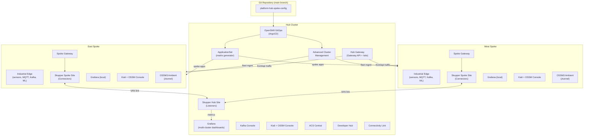
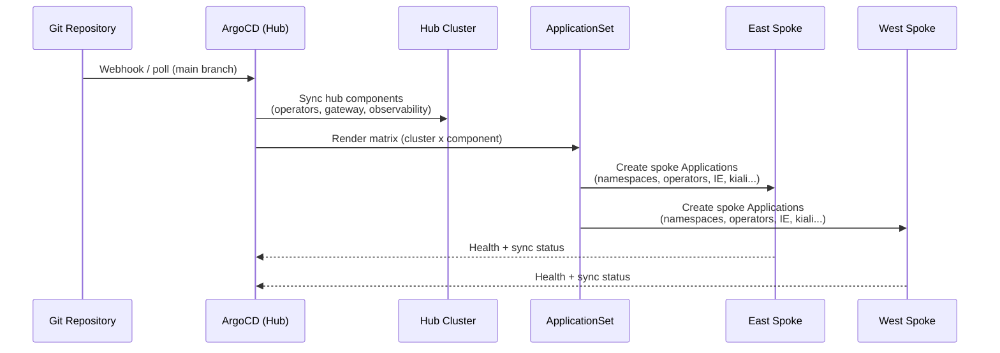
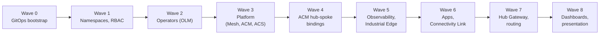
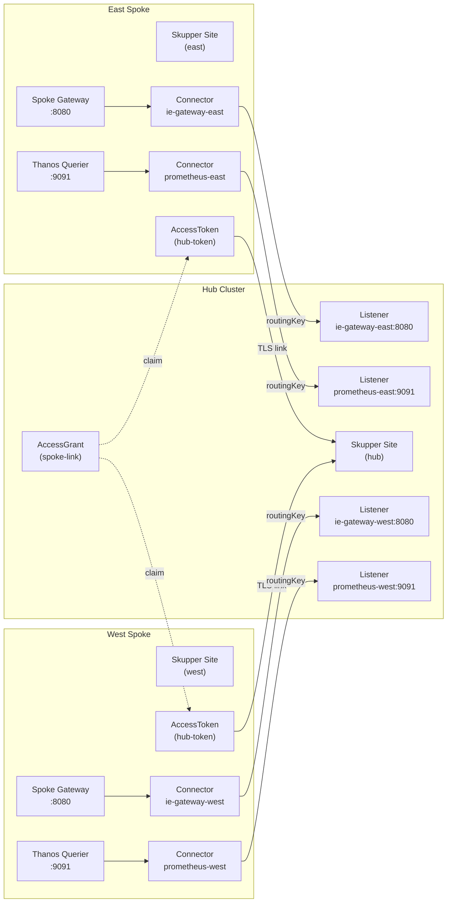
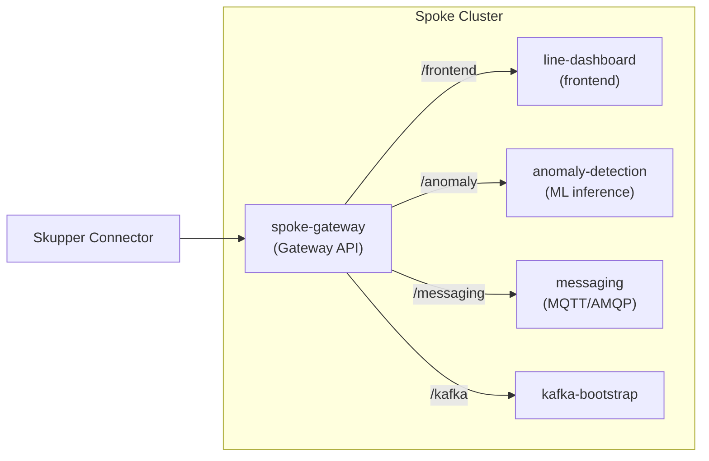
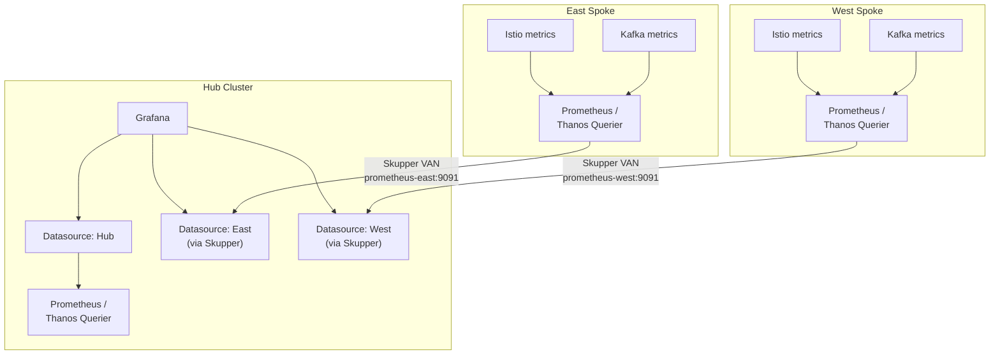
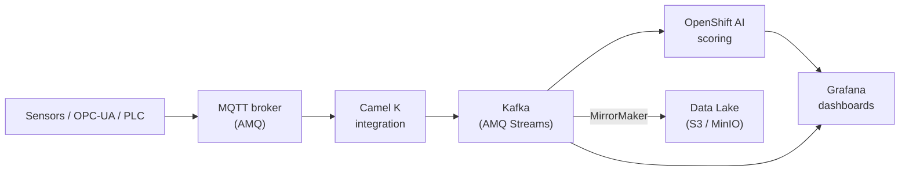

# Architecture

## Hub-spoke theory in multi-cluster Kubernetes

In multi-cluster Kubernetes, a **hub-spoke** model designates one administrative cluster (the **hub**) and one or more workload clusters (**spokes**). The hub owns fleet APIs: cluster inventory, policy placement, credentials for spoke registration, and often centralized GitOps controllers that fan out desired state.

Spokes remain the execution venues for application namespaces, data-plane components (Kafka, MQTT bridges, mesh dataplane), and regional isolation for latency, data residency, or blast-radius control.

## Why hub-spoke?

| Benefit | Description |
| --------|------------- |
| **Centralized management** | One control plane for membership, RBAC patterns, and bulk upgrades. |
| **Policy enforcement** | Kubernetes policies, compliance checks, and security baselines propagate from the hub. |
| **Observability** | Aggregated metrics, logging, and tracing strategies start at the hub and uniform dashboards span spokes. |
| **GitOps consistency** | A single Git revision strategy (with branch or overlay variants) drives spoke drift correction. |

## Platform architecture overview

## Components on the hub vs spokes

| Area | Hub | Spokes |
| -----|-----|--------|
| ACM hub operator & APIs | yes | |
| ArgoCD / App-of-Apps root | yes | |
| ApplicationSet (spoke apps) | yes | |
| ACS Central | yes | |
| ACS Secured Cluster | | yes |
| Developer Hub | yes | |
| Hub Gateway (Gateway API) | yes | |
| Spoke Gateway (Gateway API) | | yes |
| Industrial Edge workloads | | yes |
| Kafka brokers (regional) | optional | yes |
| Service Mesh ambient / ztunnel | yes | yes |
| Istio CNI (`profile: ambient`) | yes | yes |
| Skupper Site (hub listeners) | yes | |
| Skupper Site (spoke connectors) | | yes |
| Grafana (multi-cluster dashboards) | yes | |
| Grafana (local metrics) | | yes |
| Kiali + OSSM Console plugin | yes | yes |
| Connectivity Link (RHCL) | yes | yes |

## GitOps application delivery flow

## Sync wave ordering

Components deploy in strict order via ArgoCD sync waves:

## Service Interconnect (Skupper) topology

Red Hat Service Interconnect creates a Virtual Application Network (VAN) that bridges services across clusters without VPN or direct network connectivity.

## Spoke gateway aggregation

Each spoke runs a **Gateway API gateway** that fronts all Industrial Edge services, providing a single entry point for Skupper to expose to the hub.

## Multi-cluster observability pipeline

## Data flow (sensors to dashboard)

## Comparison with Red Hat Validated Patterns

The **[Multicloud GitOps](https://validatedpatterns.io/patterns/multicloud-gitops)** validated pattern demonstrates fleet GitOps with OpenShift GitOps and ACM patterns that resemble this repository's hub-push model: a declarative root Application, cluster grouping, and progressive rollout.

This platform extends that idea with **Industrial Edge** workloads, **Service Mesh ambient**, **Connectivity Link**, optional **OpenShift AI**, **ACS** depth, and **Service Interconnect** for cross-cluster service exposure -- tuned for factory-style telemetry and east-west observability rather than only infrastructure provisioning.

## Official documentation

- [ACM Architecture](https://docs.redhat.com/en/documentation/red_hat_advanced_cluster_management_for_kubernetes/2.16/html/about/welcome-to-red-hat-advanced-cluster-management-for-kubernetes)
- [Multicloud GitOps Pattern](https://validatedpatterns.io/patterns/multicloud-gitops)
- [Red Hat Service Interconnect](https://docs.redhat.com/en/documentation/red_hat_service_interconnect/2.1)
- [Kubernetes Gateway API](https://gateway-api.sigs.k8s.io/)
- [Argo CD ApplicationSet Generators](https://argo-cd.readthedocs.io/en/stable/operator-manual/applicationset/Generators/)
