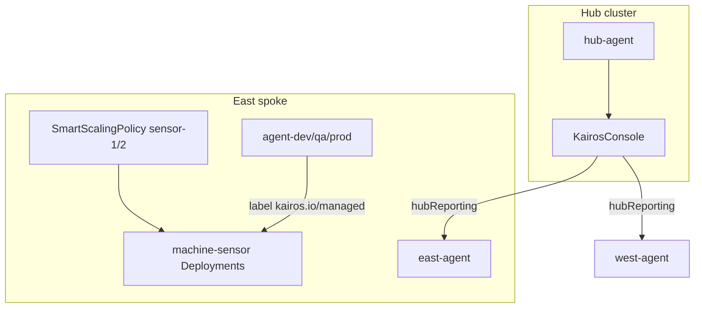

# Kairos Community Operator


{: .page-brand-logo }

AI-assisted Kubernetes optimization from the **Community Operators** catalog (`kairos-operator` v2.0.1 CSV; console image **v2.0.3**). The platform deploys it on **hub, east, and west** via GitOps (`components/kairos/`).

## Role in this platform

| Capability | CR / resource |
| ---------- | ------------- |
| Operator install | OLM `Subscription` in `kairos-system` |
| Multi-cluster UI | `KairosConsole` (hub only) |
| Workload analysis | `KairosAgent` per cluster + per environment (`-dev`, `-qa`, `-prod`) |
| Sensor / metrics scan | `SmartScalingPolicy` (scan policies on `machine-sensor-*`) |
| Events | `KairosEvent` (optional) |

Industrial Edge software templates create namespaces ending in `-dev`, `-qa`, or `-prod` so environment agents and Kairos scan tiers align with Developer Hub scaffolds.



## Kairos Console (screenshots)

Open from the **hub only**: **Application menu → Platform Hub-Spoke → Kairos Console**, or route `https://kairos-console-kairos-system.<hub-apps-domain>` (for example `cluster-xqg4c` in this workshop — not the east/west apps domain).

{: .warning }
**Console URL:** Use the **hub** route for Approvals and writes. Spoke-hosted console routes (leftover `KairosConsole` installs) may return **404** on approve actions. **Scaling Policies** (console **v2.0.2+**) lists `SmartScalingPolicy` CRs on the cluster where the console pod runs: on the hub, Git deploys **paused mirror** policies (`displayOnHub: true`) so east/west sensor policies appear with `kairos.io/display-cluster` labels; enforcement remains on the spokes. **Approvals** and **Change History** may still show demo/sample data until wired to the operator API (see [kairos console](https://github.com/maximilianoPizarro/kairos/tree/main/console)).


{: .mb-4 }
*Agents and AI-assisted workload analysis.*
{: .fs-2 .text-grey-dk-000 }


{: .mb-4 }
*Metrics and observability context for scaling decisions.*
{: .fs-2 .text-grey-dk-000 }


{: .mb-4 }
*History of policy evaluations and corrections.*
{: .fs-2 .text-grey-dk-000 }


{: .mb-4 }
*Kairos events stream.*
{: .fs-2 .text-grey-dk-000 }


{: .mb-4 }
*Supervised mode: proposals before apply (qa/prod tiers).*
{: .fs-2 .text-grey-dk-000 }

---

## How workloads are enrolled (labels vs annotations vs CRs)

Kairos does **not** use a single magic annotation on Deployments for scan policies. There are **three** integration paths:

| Path | Mechanism | What it scales |
| ---- | --------- | -------------- |
| **A — Platform sensors** | `SmartScalingPolicy` CR (GitOps on spokes) | Fixed targets `machine-sensor-1/2` in `industrial-edge-tst-all` |
| **B — Scaffolded IE apps** | Labels on Deployment + pod template | Any deployment in `*-dev`, `*-qa`, `*-prod` with `kairos.io/managed=true` |
| **C — Catalog / DevHub** | Annotation on `catalog-info.yaml` (metadata) | Documents environment for humans; agents use **labels** on manifests |

### Labels (required for path B)

Set on **Deployment metadata** and **pod template** (both must match):

```yaml
metadata:
  labels:
    kairos.io/managed: "true"
    kairos.io/environment: dev   # or qa, prod — matches scaffold parameter
```

`KairosAgent` `agent-dev-environments` watches namespaces ending in `-dev` with `labelSelector: kairos.io/managed=true`. QA and prod agents use `-qa` and `-prod` suffixes.

### Annotations (Developer Hub catalog only)

On the **Component** entity (not on the Deployment) — from the Industrial Edge template skeleton:

```yaml
apiVersion: backstage.io/v1alpha1
kind: Component
metadata:
  name: user1-factory-1-east-dev
  annotations:
    backstage.io/kubernetes-id: user1-factory-1-east-dev
    backstage.io/kubernetes-namespace: ie-factory-1-east-dev
    backstage.io/kubernetes-cluster: east
    kairos.io/environment: dev
```

These annotations power **Developer Hub** (Topology, Kubernetes tab, links). They do **not** replace `kairos.io/managed` on the Deployment.

### CRs (platform GitOps)

| CR | Cluster | Purpose |
| -- | ------- | ------- |
| `SmartScalingPolicy` | Spokes only | OTel/Prometheus rules on baseline sensors |
| `KairosAgent` | Hub + spokes | AI analysis and optional corrections |
| `KairosConsole` | Hub | UI |

See also [Annotations & Labels Reference — Kairos](../annotations-reference.html#kairos-labels-and-catalog-annotations).

---

## SmartScalingPolicy — platform baseline (2 policies per spoke) {#smartscalingpolicy-sizing}

On **each spoke**, Git deploys **two** active policies (one per baseline sensor). On the **hub**, when `sensorScanPolicies.displayOnHub` is true, Git also deploys **four paused mirrors** (`east-scan-policy-machine-sensor-*`, `west-scan-policy-machine-sensor-*`) so the hub **Kairos Console** Scaling Policies tab lists all spokes without federating the API.

| Cluster | CR names (examples) | `spec.paused` | Enforces scaling |
| ------- | ------------------- | ------------- | ---------------- |
| East / West | `scan-policy-machine-sensor-1/2` | `false` | Yes |
| Hub (display only) | `east-scan-policy-machine-sensor-1`, … | `true` | No — UI only |

Verify on spokes:

```bash
oc config use-context east   # or west
oc get smartscalingpolicy -n kairos-system
```

Expected on spokes:

- `scan-policy-machine-sensor-1` → Deployment `machine-sensor-1` in `industrial-edge-tst-all`
- `scan-policy-machine-sensor-2` → Deployment `machine-sensor-2` in `industrial-edge-tst-all`

Verify hub mirrors (console pod reads these via in-cluster API; console SA needs `smartscalingpolicies` list/watch — `templates/console-rbac.yaml`):

```bash
oc config use-context hub
oc get smartscalingpolicy -n kairos-system -l kairos.io/policy-type=sensor-scan
```

### Full example (as deployed by GitOps)

Source: `components/kairos/templates/sensor-scan-policies.yaml`

```yaml
apiVersion: kairos.maximilianopizarro.github.io/v1alpha1
kind: SmartScalingPolicy
metadata:
  name: scan-policy-machine-sensor-1
  namespace: kairos-system
  labels:
    kairos.io/policy-type: sensor-scan
spec:
  scope: cluster
  target:
    apiVersion: apps/v1
    kind: Deployment
    name: machine-sensor-1
    namespace: industrial-edge-tst-all
  otelEndpoint: cluster-collector-collector.openshift-opentelemetry.svc.cluster.local:4317
  prometheusEndpoint: prometheus-k8s.openshift-monitoring.svc.cluster.local:9090
  rules:
    - name: sensor-cpu-hot
      when:
        metric: container_cpu_usage_seconds_total
        operator: GreaterThan
        threshold: "70"      # % of limit — tune for workshop load
        for: 2m
      action:
        type: IncreaseResources
        increaseCPUPercent: 25
        maxCPU: "1"
        cooldown: 5m
    - name: sensor-memory-hot
      when:
        metric: container_memory_working_set_bytes
        operator: GreaterThan
        threshold: "80"
        for: 2m
      action:
        type: IncreaseResources
        increaseMemoryPercent: 20
        maxMemory: 1Gi
        cooldown: 5m
  ai:
    enabled: true
  paused: false
```

Duplicate the manifest with `machine-sensor-2` as the target name for the second policy.

### Sizing effort — what to tune

Use this table to **dimension** workshop or production policies (CPU/memory baselines come from the sensor Deployment requests/limits):

| Field | Workshop default | Increase effort when… | Decrease effort when… |
| ----- | ---------------- | --------------------- | --------------------- |
| `threshold` (CPU %) | `70` | Sensors stay hot under demo MQTT load | Too many false-positive scale-ups |
| `threshold` (memory %) | `80` | OOMKills or working set near limit | Memory flat, only CPU spikes |
| `for` | `2m` | Noisy metrics cause flapping | You need faster reaction to bursts |
| `increaseCPUPercent` | `25` | Single step too small vs limit | Overshoots node quota |
| `maxCPU` | `1` | Sensors need >1 core sustained | Cost / quota sensitive |
| `increaseMemoryPercent` | `20` | Memory pressure after CPU fix | Memory already over-provisioned |
| `maxMemory` | `1Gi` | Working set grows with message rate | Stay within namespace quota |
| `cooldown` | `5m` | Repeated bumps in same window | Stuck under-provisioned between cooldowns |
| `spec.ai.enabled` | `true` | Want LLM rationale in console | Offline/lab without OpenShift AI |
| `paused` | `false` | Freeze cluster for debugging | — |

**Baseline sensor resources** (scaffolder skeleton — tune together with policy thresholds):

```yaml
resources:
  requests:
    cpu: 50m
    memory: 256Mi
  limits:
    cpu: 500m
    memory: 512Mi
```

If limits are low, a `70%` CPU rule fires at ~350m; raising limits without raising `maxCPU` in the policy caps how far Kairos can grow.

### Custom SmartScalingPolicy (extra workload)

To monitor another Deployment (e.g. a Camel integration):

```yaml
apiVersion: kairos.maximilianopizarro.github.io/v1alpha1
kind: SmartScalingPolicy
metadata:
  name: scan-policy-my-integration
  namespace: kairos-system
spec:
  scope: cluster
  target:
    apiVersion: apps/v1
    kind: Deployment
    name: camel-integration
    namespace: ie-my-factory-east-qa
  otelEndpoint: cluster-collector-collector.openshift-opentelemetry.svc.cluster.local:4317
  prometheusEndpoint: prometheus-k8s.openshift-monitoring.svc.cluster.local:9090
  rules:
    - name: cpu-sustain
      when:
        metric: container_cpu_usage_seconds_total
        operator: GreaterThan
        threshold: "60"
        for: 5m
      action:
        type: IncreaseResources
        increaseCPUPercent: 15
        maxCPU: "2"
        cooldown: 10m
  ai:
    enabled: true
  paused: false
```

Also add `kairos.io/managed: "true"` if the workload should appear under the **environment agents** (`-qa` suffix above).

---

## KairosAgent tiers (scaffolded namespaces)

Git deploys these agents in `kairos-system`:

| Agent | Namespace suffix | Mode | dryRun | maxActions/hour | Effort |
| ----- | ---------------- | ---- | ------ | --------------- | ------ |
| `agent-dev-environments` | `-dev` | autopilot | false | 50 | Highest — auto-apply |
| `agent-qa-environments` | `-qa` | supervised | false | 20 | Review in console |
| `agent-prod-environments` | `-prod` | supervised | true | 10 | Safest — dry-run only |
| `hub-agent` / `east-agent` / `west-agent` | cluster | supervised | true | 10 | Cluster-wide, dry-run on hub |

Example fragment (`components/kairos/templates/kairos-agents.yaml` pattern):

```yaml
apiVersion: kairos.maximilianopizarro.github.io/v1alpha1
kind: KairosAgent
metadata:
  name: agent-qa-environments
  namespace: kairos-system
spec:
  mode: supervised
  watch:
    namespaceSuffix: "-qa"
    resourceTypes:
      - Deployment
      - StatefulSet
    labelSelector: kairos.io/managed=true
  correctionPolicy:
    dryRun: false
    maxActionsPerHour: 20
    rollbackOnFailure: true
  aiModel:
    apiURL: "https://isvc-granite-31-8b-fp8-predictor.sandbox-shared-models.svc.cluster.local:8443/v1/chat/completions"
    model: granite-31-8b
    apiKeySecret:
      name: kairos-ai-credentials
      key: api-key
```

---

## AI model credentials (do not lose on reinstall)

The Granite / OpenShift AI endpoint is configured in Git; **credentials stay in the cluster only**:

```text
Secret: kairos-system/kairos-ai-credentials
Key:    api-key   (see values.yaml — kairos.aiCredentials.secretKey)
```

Argo CD **ignoreDifferences** on that Secret prevents GitOps from overwriting your key. Before reinstall:

```bash
oc get secret kairos-ai-credentials -n kairos-system -o yaml > /tmp/kairos-ai-credentials.backup.yaml
# Remove metadata.resourceVersion, uid, etc. if restoring manually
```

After sync, agents reference the same Secret name via `spec.aiModel.apiKeySecret`.

Default model URL (hub OpenShift AI):

`https://isvc-granite-31-8b-fp8-predictor.sandbox-shared-models.svc.cluster.local:8443/v1/chat/completions`

## Reinstall from catalog (replace manual CRDs)

Previously CRDs were applied with `kubectl`; the catalog **ClusterServiceVersion** now owns them. Safe migration:

1. **Back up** `kairos-ai-credentials` (above).
2. **Commit and sync** `field-content-kairos` (hub) and `kairos-east` / `kairos-west` spoke apps.
3. **Remove duplicate manual installs** only if they conflict (same CRDs from CSV are fine):

   ```bash
   # Optional: delete old kubectl-applied CRs that duplicate Git names
   oc delete kairosagent hub-agent -n kairos-system --ignore-not-found
   # Git will recreate hub-agent, agent-dev-environments, etc.
   ```

4. **Do not delete** `kairos-ai-credentials` or the `Subscription` if the operator is already healthy.

Verify:

```bash
oc get subscription kairos-operator -n kairos-system
oc get csv -n kairos-system | grep kairos
oc get kairosagent,smartscalingpolicy -n kairos-system
```

### Console shows “Kairos Operator — N projects failed”

Usually **not** N broken workloads. OLM marks the CSV as failed in every namespace when:

1. **Two OperatorGroups** exist in `kairos-system` (leftover `operator-sdk-og` from a manual `operator-sdk` run + GitOps `kairos-operator`).
2. The GitOps OperatorGroup used `spec: {}` (AllNamespaces), so the console lists ~66 namespace rows.

Fix:

```bash
# Remove manual leftover (hub and spokes)
oc delete operatorgroup operator-sdk-og -n kairos-system --ignore-not-found

# After Git sync: kairos-operator OG must use targetNamespaces: [kairos-system]
oc get operatorgroup -n kairos-system
oc get csv kairos-operator.v2.0.1 -n kairos-system
```

Controller/console pods can be **Running** while the CSV still shows `Failed` / `TooManyOperatorGroups` until the above is cleaned up.

## OpenShift Console menu

Hub **ConsoleLink** `platform-kairos-console` opens the Kairos governance UI with the [Kairos Community](https://github.com/maximilianoPizarro/kairos) icon (`components/console-links/files/icons/kairos.svg`). Regenerate menu icons: `NANOBANANA_API_KEY=... ./scripts/generate-console-icons.sh`

## Developer Hub templates

When scaffolding Industrial Edge or Camel/Kaoto, choose **Environment** (`dev` / `qa` / `prod`). Artifact names include the suffix, for example:

- Repo: `edge-factory-1-east-dev`
- Namespace: `ie-edge-factory-1-east-dev`
- Catalog component: `user1-edge-factory-1-dev`

Use three scaffolds (same factory, different environments) to exercise all three Kairos agent tiers.

## Git paths

| Cluster | Argo Application | Chart |
| ------- | ------------------ | ----- |
| Hub | `field-content-kairos` | `components/kairos/` |
| East | `kairos-east` | `components/kairos/` |
| West | `kairos-west` | `components/kairos/` |

Upstream operator: [github.com/maximilianoPizarro/kairos](https://github.com/maximilianoPizarro/kairos)
