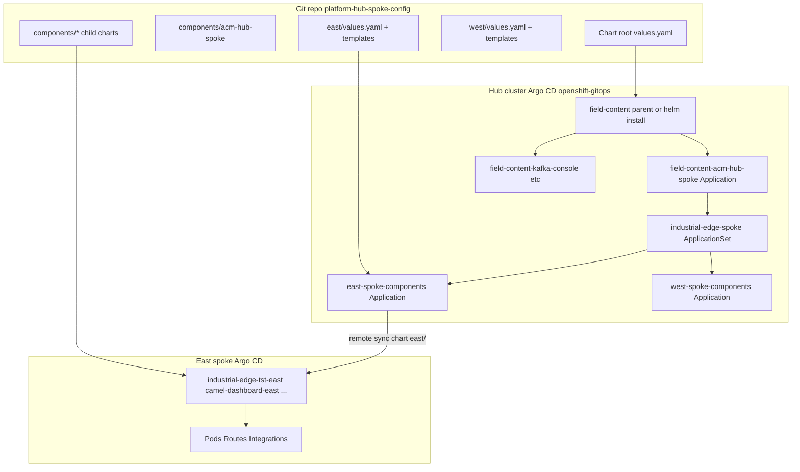

# GitOps deployment chain (hub → spokes)

This page explains **why** you see names like `field-content-acm-hub-spoke`, `east-spoke-components`, and `industrial-edge-tst-east` in ACM / Argo CD, and **which YAML** creates each link.

{: .note }
> **ACM Fleet → Applications** lists **Argo CD `Application`** resources. The **ApplicationSet** `industrial-edge-spoke` is a separate object. Search for it under **Infrastructure → Clusters → GitOps** (Argo CD UI) or with `oc get applicationset industrial-edge-spoke -n openshift-gitops`.

## End-to-end diagram



## Layer 1 — Hub bootstrap (root chart)

**What you run once on the hub:**

```bash
helm upgrade --install field-content . \
  -f values.yaml \
  --set deployer.domain=apps.<hub-domain>
```

**What it renders:** one Argo CD `Application` per entry in `connectivityLink.apps[]` in [`values.yaml`](../values.yaml).

Fragment from [`templates/component-applications.yaml`](../templates/component-applications.yaml):

```yaml
{{- range .Values.connectivityLink.apps }}
{{- if and . .enabled }}
apiVersion: argoproj.io/v1alpha1
kind: Application
metadata:
  name: {{ $.Release.Name }}-{{ .id }}    # e.g. field-content-acm-hub-spoke
  namespace: openshift-gitops
spec:
  source:
    repoURL: {{ $.Values.gitops.repoUrl }}
    path: components/{{ .path }}          # e.g. acm-hub-spoke
  destination:
    server: https://kubernetes.default.svc
    namespace: {{ .destinationNamespace }}
{{- end }}
```

Entry for ACM in [`values.yaml`](../values.yaml):

```yaml
connectivityLink:
  apps:
    - id: acm-hub-spoke
      enabled: true
      path: acm-hub-spoke
      destinationNamespace: openshift-gitops
      syncWave: "0"
```

**ACM UI:** `field-content-acm-hub-spoke` on **local-cluster** — this is the **parent of the fleet ApplicationSet**, not the ApplicationSet itself.

---

## Layer 2 — ACM + ApplicationSet (`components/acm-hub-spoke`)

When `field-content-acm-hub-spoke` syncs, it applies **Placement**, **GitOpsCluster**, **ConfigMap `acm-placement`**, and the **ApplicationSet** (sync waves 1–4).

### 2a — Placement selects east and west

[`components/acm-hub-spoke/templates/placement.yaml`](../components/acm-hub-spoke/templates/placement.yaml):

```yaml
apiVersion: cluster.open-cluster-management.io/v1beta1
kind: Placement
metadata:
  name: hub-spoke-placement
  namespace: openshift-gitops
  labels:
    cluster.open-cluster-management.io/placement: hub-spoke-placement
spec:
  clusterSets:
    - global
  predicates:
    - requiredClusterSelector:
        labelSelector:
          matchExpressions:
            - key: region
              operator: In
              values: [east, west]
```

ACM creates **PlacementDecision** objects listing cluster names (`east`, `west`).

### 2b — ConfigMap tells the generator how to read decisions

[`components/acm-hub-spoke/templates/acm-placement-configmap.yaml`](../components/acm-hub-spoke/templates/acm-placement-configmap.yaml):

```yaml
apiVersion: v1
kind: ConfigMap
metadata:
  name: acm-placement
  namespace: openshift-gitops
data:
  apiVersion: cluster.open-cluster-management.io/v1beta1
  kind: placementdecisions
  matchKey: clusterName
  statusListKey: decisions
```

### 2c — ApplicationSet (fleet root for spokes)

[`components/acm-hub-spoke/templates/applicationset.yaml`](../components/acm-hub-spoke/templates/applicationset.yaml):

```yaml
apiVersion: argoproj.io/v1alpha1
kind: ApplicationSet
metadata:
  name: industrial-edge-spoke          # <-- search this name in CLI / Argo CD
  namespace: openshift-gitops
  labels:
    cluster.open-cluster-management.io/placement: hub-spoke-placement
spec:
  generators:
    - clusterDecisionResource:
        configMapRef: acm-placement
        labelSelector:
          matchLabels:
            cluster.open-cluster-management.io/placement: hub-spoke-placement
  template:
    metadata:
      name: '{{name}}-spoke-components'   # east-spoke-components, west-spoke-components
    spec:
      source:
        repoURL: https://github.com/.../platform-hub-spoke-config
        path: '{{name}}'                    # east/  or  west/
      destination:
        name: '{{name}}'                    # Argo CD cluster secret: east | west
        namespace: openshift-gitops
      syncPolicy:
        automated:
          selfHeal: true
          prune: true
```

| Generator variable | Becomes in template |
| ------------------ | ------------------- |
| `{{name}}` | `east` / `west` — folder and Argo cluster name |
| (from PlacementDecision) | One `Application` per selected cluster |

**Important:** This ApplicationSet is a **normal** manifest (sync-wave `4`), not a PostSync hook, so it **stays** in the cluster and ACM can index it.

---

## Layer 3 — Spoke parent Applications (`east/` / `west/`)

`east-spoke-components` (on the **hub** Argo CD, destination **east**) syncs the Helm chart in [`east/`](../east/).

[`east/templates/component-applications.yaml`](../east/templates/component-applications.yaml) loops `apps[]` from [`east/values.yaml`](../east/values.yaml):

```yaml
{{- range .Values.apps }}
apiVersion: argoproj.io/v1alpha1
kind: Application
metadata:
  name: {{ .id }}-{{ $.Values.clusterName }}   # industrial-edge-tst-east
spec:
  source:
    repoURL: {{ $.Values.gitops.repoUrl }}
    path: {{ .path }}                           # components/industrial-edge-tst
  destination:
    server: https://kubernetes.default.svc      # spoke local API
    namespace: {{ .destinationNamespace }}
{{- end }}
```

Example app entries ([`east/values.yaml`](../east/values.yaml)):

```yaml
apps:
  - id: operators
    path: components/operators
    destinationNamespace: openshift-operators
    syncWave: "2"
  - id: camel-dashboard-openshift-all
    path: components/camel-dashboard-openshift
    destinationNamespace: camel-dashboard
    syncWave: "3"
  - id: industrial-edge-tst
    path: components/industrial-edge-tst
    destinationNamespace: industrial-edge-tst-all
    syncWave: "5"
```

**ACM UI:** Searching `industrial-edge` shows these **child** Applications (`industrial-edge-tst-east`, …). They are **not** created by the ApplicationSet directly; they are created by the **east** chart on the **spoke's** Argo CD.

---

## Layer 4 — Workloads (`components/*`)

Each child `Application` points at a Helm chart under `components/<name>/` (Kafka, Camel K, gateways, etc.). Those charts render Deployments, Routes, `Integration`, and so on.

---

## Naming cheat sheet

| Name you see | Kind | Where it runs | Created by |
| ------------ | ---- | ------------- | ---------- |
| `field-content-acm-hub-spoke` | Application | Hub | Root `values.yaml` → hub template |
| `industrial-edge-spoke` | **ApplicationSet** | Hub | `components/acm-hub-spoke` |
| `east-spoke-components` | Application | Hub → deploys to east | ApplicationSet template |
| `industrial-edge-tst-east` | Application | East | `east/` chart |
| `field-content-kafka-console` | Application | Hub | Root `values.yaml` (hub-only) |

---

## Sync order (hub ACM chart)

| Wave | Resource |
| ---- | -------- |
| 0 | RBAC for ApplicationSet controller |
| 1 | ManagedClusterSet binding |
| 2 | Placement + **acm-placement** ConfigMap |
| 3 | GitOpsCluster |
| 4 | **ApplicationSet `industrial-edge-spoke`** |

Spoke chart waves (inside `east/` / `west/`) are documented in [Architecture — Spoke sync-wave reference](architecture.md#spoke-sync-wave-reference).

---

## Verify the chain

```bash
# Hub — ApplicationSet must exist (not only child Applications)
oc config use-context hub
oc get applicationset industrial-edge-spoke -n openshift-gitops
oc get placementdecisions -n openshift-gitops -l cluster.open-cluster-management.io/placement=hub-spoke-placement
oc get applications -n openshift-gitops | grep spoke-components

# East — child apps from east/ chart
oc config use-context east
oc get applications -n openshift-gitops | grep -E 'east$|east '
```

After changing `components/acm-hub-spoke`:

```bash
oc annotate application field-content-acm-hub-spoke -n openshift-gitops \
  argocd.argoproj.io/refresh=hard --overwrite
```

---

## Related docs

- [Deploy with ACM and GitOps](deploy-acm-gitops.md)
- [Getting Started](getting-started.md)
- [Troubleshooting — ApplicationSet](troubleshooting.md#applicationset-both-name-and-server-defined)
