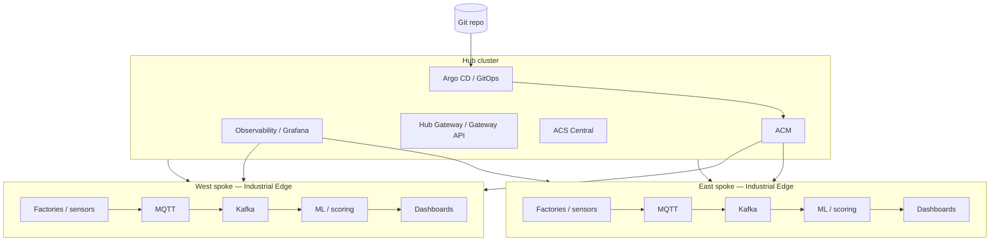

# Platform Hub-Spoke Config

**Multi-cluster GitOps platform using Red Hat products** — a hub-spoke topology that centralizes governance with Red Hat Advanced Cluster Management (ACM), delivers Industrial Edge workloads on regional spokes, uses OpenShift Service Mesh in ambient mode for east-west connectivity, layers Connectivity Link (Kuadrant) for API-aware ingress policy, exposes Grafana dashboards for cross-cluster visibility, and integrates Advanced Cluster Security (ACS) for vulnerability and runtime protection.

## Overview

This repository models a **GitOps-first platform** where:

- **Hub cluster** runs ACM, OpenShift GitOps (Argo CD), observability aggregation, optional Developer Hub, ACS Central, and gateway-style HTTP routing for shared services.
- **Spoke clusters** (east/west regions) host **Industrial Edge** patterns: sensor and MQTT-style ingestion, Kafka pipelines, optional ML scoring, and dashboards fed by Prometheus-compatible metrics.
- **Service Mesh 3 ambient** reduces sidecar overhead while retaining ztunnel-based L4 and waypoint-based L7 policy where needed.
- **Connectivity Link** aligns with Kubernetes Gateway API and Kuadrant policies (often introduced gradually; policies may start disabled).
- **Grafana dashboards** roll up cluster and application signals for operators.
- **ACS** provides centralized policy, CVE visibility, and SecuredCluster agents on spokes.

## Quick links

| Topic | Page |
| ------ | ------ |
| Architecture deep dive | [Architecture](architecture.md) |
| Install flow | [Getting Started](getting-started.md) |
| ACM + GitOps | [Deploy with ACM and GitOps](deploy-acm-gitops.md) |
| Red Hat products | [Red Hat Products](products/) |
| Hub Gateway | [Hub Gateway](hub-gateway.md) |
| Observability | [Observability](observability.md) |
| Industrial Edge | [Industrial Edge](industrial-edge.md) |
| Branch strategy | [Branch Strategy](branch-strategy.md) |

## Red Hat products used

- Red Hat OpenShift Container Platform
- Red Hat Advanced Cluster Management for Kubernetes
- Red Hat OpenShift GitOps (Argo CD)
- Red Hat Advanced Cluster Security for Kubernetes
- Red Hat OpenShift Service Mesh
- Red Hat Connectivity Link (Kuadrant, Gateway API)
- Red Hat OpenShift AI
- Red Hat AMQ Streams (Apache Kafka)
- Red Hat build of Apache Camel / Camel K
- Red Hat OpenShift Pipelines (Tekton)
- Red Hat Developer Hub (Backstage)
- Observability stack (Prometheus-compatible metrics, Grafana, OpenTelemetry, Kiali where deployed)
