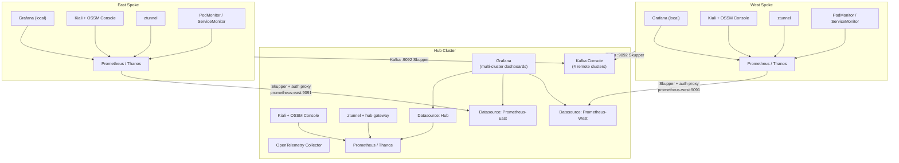

# Observability

Observability ties together **metrics**, **logs**, **traces**, and **mesh visualization** so operators can compare east and west Industrial Edge clusters from the hub.


{: .mb-4 }
*Grafana East-West Traffic & Service Mesh dashboard with multi-cluster datasources.*
{: .fs-2 .text-grey-dk-000 }


{: .mb-4 }
*Multi-Cluster Istio Metrics — L4 ztunnel throughput and cross-cluster error rates via Service Interconnect.*
{: .fs-2 .text-grey-dk-000 }

## Observability architecture



## Components

| Layer | Technology | Role |
| ----- | ----------- | ---- |
| Metrics | User Workload Monitoring / Prometheus | RED/USE signals, Kafka lag, mesh L4/L7 stats |
| Dashboards (hub) | Grafana + multi-cluster datasources | Fleet and factory KPI views (`components/grafana-dashboards`) |
| Dashboards (spoke) | Grafana local | Per-cluster ztunnel L4, Kafka, workloads (`components/spoke-dashboards`) |
| Mesh UI | Kiali + OSSM Console plugin | Traffic graphs in OpenShift Console |
| Kafka UI | Streams for Apache Kafka Console | Hub UI for all spoke Kafka clusters (`components/kafka-console`) |
| Cross-cluster metrics | Skupper + GrafanaDatasource | Prometheus metrics via VAN |
| Tracing | OpenTelemetry Collector | Distributed traces |

## Service Mesh metrics (OSSM3 GA + ztunnel)

Use **`stable-3.2`** for the Service Mesh operator. Tech Preview (`candidates` / 3.0.0-tp.2) does not deploy ztunnel.

| Metric | Producer | Notes |
| ------ | -------- | ----- |
| `istio_tcp_connections_opened_total` | ztunnel | Primary spoke/hub L4 signal |
| `istio_tcp_sent_bytes_total` / `received` | ztunnel | Bytes per workload namespace |
| `istio_requests_total` | Waypoints, ingress gateways | L7; hub `hub-gateway-istio` always has some traffic |
| `kafka_server_kafkaserver_brokerstate` | Strimzi JMX | `3` = Running; use in Grafana **gauge** panels |
| `kafka_network_requestmetrics_requestspersec_total` | Strimzi JMX | API activity; use in **bargauge** panels |
| `kafka_server_replicamanager_leadercount` / `partitioncount` | Strimzi JMX | **piechart** / **bargauge** on hub fleet view |

`components/istio-monitoring` scrapes istiod, gateways/waypoints, ztunnel, and Kafka. Grant UWM RoleBindings in `istio-system`, `ztunnel`, `hub-gateway-system`, and Industrial Edge namespaces.

**Prerequisite for L4 mesh metrics:** `IstioCNI` CR must include `profile: ambient` (not namespace-only). Without it, ztunnel never becomes Ready and `istio_tcp_*` are absent. See [Service Mesh 3 — troubleshooting](products/service-mesh.md#troubleshooting-ztunnel-ztunnelnothealthy).

## Kiali and OSSM Console plugin

Each cluster (hub and spokes) runs **Kiali** with an **OSSMConsole** CR. The dynamic plugin adds **Service Mesh** to the OpenShift Console.

### Fixing 401 Unauthorized on the plugin

The plugin proxies API calls to Kiali, which queries **Thanos Querier** (`:9091`). Kiali's service account needs cluster monitoring read access.

**GitOps** (`components/kiali/templates/all.yaml`):

```yaml
apiVersion: rbac.authorization.k8s.io/v1
kind: ClusterRoleBinding
metadata:
  name: kiali-monitoring-rbac
roleRef:
  kind: ClusterRole
  name: cluster-monitoring-view
subjects:
- kind: ServiceAccount
  name: kiali-service-account
  namespace: openshift-cluster-observability-operator
```

Kiali CR `external_services.prometheus`:

```yaml
prometheus:
  auth:
    type: bearer
    use_kiali_token: true
  thanos_proxy:
    enabled: true
  url: https://thanos-querier.openshift-monitoring.svc.cluster.local:9091
```

With **ztunnel** running, Kiali shows L4 traffic graphs; L7 graphs appear for HTTP routed through waypoints.

## Grafana + Thanos (dashboards with data)

Hub Grafana uses a ServiceAccount token for local Thanos and **HTTP** URLs for remote spokes (Skupper auth proxy — no bearer token from hub).

Spoke Grafana uses the **default** Prometheus datasource (local Thanos). Do not point spoke dashboards at hub Skupper listener names unless intentionally cross-querying.

**Metric panels:**

| Dashboard | Visualizations | Data sources |
| --------- | -------------- | -------------- |
| `east-west-traffic` | Gauges (broker state), donut pie (leaders East/West), bargauge (partitions, Kafka API req/s) | Hub + Prometheus-East/West |
| `multi-cluster-istio` | Timeseries + L4 **bargauge** per cluster | Mixed datasources |
| `local-metrics` | ztunnel readiness **gauge**, Kafka bargauge/piechart, L4 timeseries | Local Thanos |

- Hub gateway / Istio HTTP panels may show **no data** until clients generate traffic through `hub-gateway-istio` or waypoints.
- Kafka panels use `kafka_network_requestmetrics_*` and `kafka_server_replicamanager_*` — not `brokertopicmetrics` with `_objectname` filters.

Enable **User Workload Monitoring** on spokes (`cluster-monitoring-config` → `enableUserWorkload: true`).

**Quick validation:**

```bash
oc get ds -n ztunnel
oc logs -n istio-cni $(oc get pods -n istio-cni -o name | head -1) | grep AmbientEnabled
# Expect: AmbientEnabled: true
```

## Multi-cluster metrics via Skupper

Spoke Thanos is exposed through an **Nginx auth proxy** on each spoke (injects bearer token), then a Skupper **Connector**. Hub **Listeners** `prometheus-east` / `prometheus-west` feed Grafana datasources.

See [Service Interconnect](service-interconnect.md) for the full VAN diagram.

## Kafka Console (hub)

The **Streams for Apache Kafka Console** on the hub registers five clusters: `prod-cluster` (hub, full metrics) + dev/factory × east/west via Skupper bootstrap services.

**Metrics configuration:** The `metricsSources` type `openshift-monitoring` is broken in Console operator 0.12.x (logs: `Prometheus URL is not configured`). Use `type: standalone` with:
- URL: `https://thanos-querier.openshift-monitoring.svc.cluster.local:9091`
- Bearer token via `kubernetes.io/service-account-token` Secret
- TrustStore: `openshift-service-ca.crt` ConfigMap (PEM)
- `ClusterRoleBinding` for `cluster-monitoring-view`

Each `kafkaCluster` entry **must include `namespace`** — without it, logs show `namespace is required for metrics retrieval`.

Only the hub `prod-cluster` (namespace `industrial-edge-data-lake`) displays full metrics. Spoke clusters via Skupper show topics and nodes but no metrics (their Prometheus data is not federated to hub Thanos).

**Common error:** `Timed out waiting for a node assignment` / `listNodes` — the console reaches bootstrap over Skupper but broker **advertised DNS** from spokes does not resolve on the hub.

**Fix:**

1. Spokes: Strimzi `advertisedHost` per broker with `clusterName` suffix (`dev-cluster-broker-0-east`, etc.)
2. Hub: headless Services + **`EndpointSlice`** in `components/kafka-console/templates/broker-dns.yaml` (Helm `lookup` of Skupper ClusterIPs per broker)

Argo CD **excludes `Endpoints`** from managed resources — use `EndpointSlice` so broker DNS syncs via GitOps.

Re-sync the `kafka-console` Argo CD application after Skupper listeners are healthy. Confirm `listNodes` returns 200 in the Console UI.

## Grafana dashboard inventory

| Dashboard | Scope | Datasources |
| --------- | ----- | ----------- |
| `east-west-traffic` | Hub | Hub, Prometheus-East, Prometheus-West — Kafka health row (gauges, pie, bargauge) |
| `multi-cluster-istio` | Hub | Hub, Prometheus-East, Prometheus-West — L4 bargauge + error/latency timeseries |
| `local-metrics` | Each spoke | Local Prometheus (UWM/Thanos) — ztunnel + Kafka + workloads |

## References

- [OpenShift Observability](https://docs.redhat.com/en/documentation/openshift_container_platform/latest/html/monitoring/)
- [Red Hat Service Interconnect](https://docs.redhat.com/en/documentation/red_hat_service_interconnect/2.1)
- [OSSM 3.2 ambient mode](https://docs.redhat.com/en/documentation/red_hat_openshift_service_mesh/3.2/html/installing/ossm-istio-ambient-mode)
- [Kiali on OSSM 3.2](https://docs.redhat.com/en/documentation/red_hat_openshift_service_mesh/3.2/html/observability/kiali-operator-provided-by-red-hat)

Charts: `components/observability`, `components/grafana-dashboards`, `components/spoke-dashboards`, `components/kiali`, `components/kafka-console`, `components/opentelemetry`, `components/istio-monitoring`, `components/service-interconnect`, `components/spoke-interconnect`.
