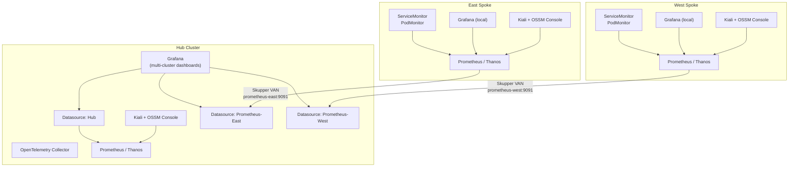
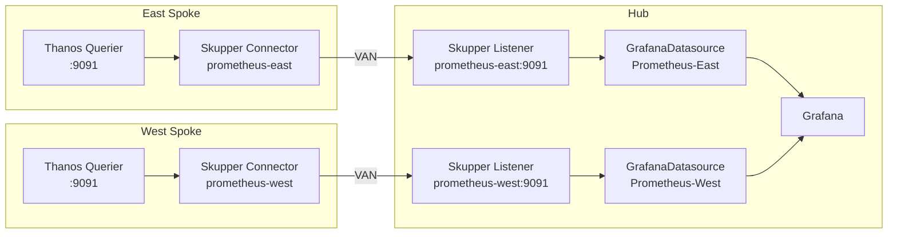

# Observability

Observability ties together **metrics**, **logs**, **traces**, and **mesh visualization** so operators can compare east and west Industrial Edge clusters from the hub.

## Observability architecture



## Components

| Layer | Technology | Role |
| ----- | ----------- | ---- |
| Metrics | User Workload Monitoring / Prometheus | RED/USE signals, Kafka lag, mesh stats |
| Dashboards (hub) | Grafana + multi-cluster datasources | Fleet and factory KPI views (`components/grafana-dashboards`) |
| Dashboards (spoke) | Grafana local | Per-cluster Istio, Kafka, app metrics (`components/spoke-dashboards`) |
| Mesh UI | Kiali + OSSM Console plugin | Traffic graphs in OpenShift Console |
| Cross-cluster metrics | Skupper + GrafanaDatasource | Prometheus metrics via VAN (`components/service-interconnect`) |
| Tracing | OpenTelemetry Collector & backends | Distributed traces across integrations |

## Kiali setup for Service Mesh 3

Kiali requires explicit configuration to access Prometheus and Grafana. Without this, the UI loads but all traffic graphs show empty:

1. **Grant Prometheus read access** to Kiali's service account:
   ```bash
   oc adm policy add-cluster-role-to-user cluster-monitoring-view \
     -z kiali-service-account -n openshift-cluster-observability-operator
   ```

2. **Configure auth** in the Kiali CR:
   ```bash
   oc patch kiali kiali -n openshift-cluster-observability-operator --type merge -p '{
     "spec": {
       "external_services": {
         "prometheus": { "auth": { "type": "bearer", "use_kiali_token": true } },
         "grafana": { "auth": { "type": "basic", "username": "admin", "password": "admin" } }
       }
     }
   }'
   ```

## Prometheus scraping for Istio metrics

OpenShift Prometheus does **not** scrape Istio metrics by default. You must create:

- **ServiceMonitor** for `istiod` (port `http-monitoring` / 15014, path `/metrics`)
- **PodMonitor** for waypoint/gateway proxies (port `metrics` / 15020, path `/stats/prometheus`)

Additionally, the User Workload Prometheus needs **RoleBindings** in each mesh namespace (`istio-system`, `hub-gateway-system`, `industrial-edge-tst-all`, etc.) to grant the `prometheus-k8s` ClusterRole to the `prometheus-user-workload` ServiceAccount.

Key metrics path differences:
- **istiod**: `/metrics` (standard Prometheus format)
- **Envoy proxies** (gateways, waypoints): `/stats/prometheus` (Envoy admin format)

## Grafana + Thanos (dashboards with data)

Grafana **11** often ships with **HTTP basic auth to the Grafana API disabled**. The Grafana Operator must authenticate to Grafana to install datasources; if that fails, the **Prometheus** datasource never syncs and dashboards show **No data** even when metrics exist in Prometheus.

This repository configures:

1. **`[auth.basic] enabled`** on the `Grafana` CR via `spec.config.auth.basic` as a **string** containing a small INI snippet (`[auth.basic]` / `enabled = true`), because the Grafana Operator CRD expects `auth.basic` to be a string, not a nested object.
2. A **ServiceAccount** (`grafana-thanos-reader`) bound to **`cluster-monitoring-view`**, plus a **`kubernetes.io/service-account-token`** Secret.
3. **`GrafanaDatasource.valuesFrom`** so the Thanos `Authorization: Bearer …` header is built from that token (instead of the non-functional `${GRAFANA_SA_TOKEN}` placeholder).

After syncing, confirm the datasource in the Grafana UI (**Connections → Data sources → Prometheus → Save & test**) and use **Explore** with `up` or `istio_requests_total`.

**OpenShift Route and `root_url`:** if the UI shows *“failed to load its application files”* (static assets 404), set **`spec.config.server.root_url`** to the public HTTPS URL of the Grafana Route (same host as `spec.route.spec.host`, e.g. `https://grafana.<apps-domain>/`). Grafana builds asset URLs from `root_url`; without it, the SPA often breaks behind edge TLS termination.

**Login:** basic auth to the UI remains enabled (`admin` / `admin` from `spec.config.security` in GitOps); do **not** ship those defaults on production clusters.

## Multi-cluster metrics via Skupper

Spoke Prometheus/Thanos metrics are exported to the hub via Red Hat Service Interconnect (Skupper). Each spoke has a **Connector** that exposes its local Thanos Querier, and the hub has **Listeners** that receive those connections.



Hub Grafana dashboards (`east-west-traffic`, `multi-cluster-istio`) use datasource variables (`ds_east`, `ds_west`) to query spoke metrics alongside hub metrics.

## Kiali and OSSM Console plugin

Each cluster (hub and spokes) runs its own **Kiali** instance with the **OSSMConsole** CR that activates the dynamic console plugin. This adds a **Service Mesh** section to the OpenShift Console navigation bar with topology visualization.

Spoke Kiali instances provide full local mesh graphs. Hub Kiali shows hub-cluster traffic only; cross-cluster visibility comes from Grafana's multi-cluster dashboards and Skupper-exposed services.

## Grafana dashboard inventory

| Dashboard | Scope | Datasources |
| --------- | ----- | ----------- |
| `east-west-traffic` | Hub | Hub, Prometheus-East, Prometheus-West |
| `multi-cluster-istio` | Hub | Hub, Prometheus-East, Prometheus-West |
| `local-metrics` | Each spoke | Local Prometheus |

## References

- [OpenShift Observability](https://docs.redhat.com/en/documentation/openshift_container_platform/latest/html/monitoring/)
- [Red Hat Service Interconnect](https://docs.redhat.com/en/documentation/red_hat_service_interconnect/2.1)
- [OpenTelemetry on OpenShift](https://docs.redhat.com/en/documentation/openshift_container_platform/latest/html/red_hat_build_of_opentelemetry/)
- [Kiali Service Mesh observability](https://docs.redhat.com/en/documentation/openshift_container_platform/latest/html/service_mesh/)

Charts: `components/observability`, `components/grafana-dashboards`, `components/spoke-dashboards`, `components/kiali`, `components/opentelemetry`, `components/istio-monitoring`, `components/service-interconnect`, `components/spoke-interconnect`.
