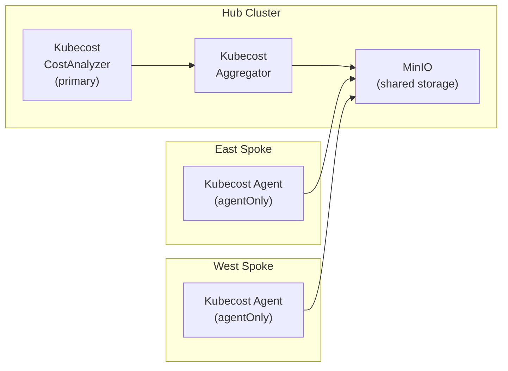

# Kubecost

Red Hat certified **Kubecost** operator provides Kubernetes cost monitoring and optimization via Federated ETL for multicluster visibility.

## Role in this platform

Kubecost is deployed as a **hub primary** (aggregator) and **spoke agents**. Spokes push ETL data to shared object storage (MinIO), and the hub aggregates cost data across all clusters.

## Architecture



## Deployment notes

| Cluster | Role | CostAnalyzer config |
| ------- | ---- | ------------------- |
| Hub | primary | `agentOnly: false`, `kubecostAggregator.deployMethod: statefulset` |
| East/West | agent | `agentOnly: true`, no aggregator |

### OperatorGroup

The Kubecost operator does **NOT** support `AllNamespaces` install mode. Always configure:

```yaml
spec:
  targetNamespaces:
    - kubecost
```

### Security Context Constraints

Kubecost pods require **privileged** SCC (not just `anyuid`) because they run as UID 1001 with `fsGroup: 1001` and include `seccomp` annotations. Grant to these service accounts:

- `kubecost-cost-analyzer`
- `kubecost-grafana`
- `kubecost-prometheus-server`
- `kubecost-forecasting`
- `default` (used by `kubecost-forecasting` deployment which has no explicit `serviceAccountName`)

### Federated storage

All clusters share a MinIO bucket (`kubecost`) in namespace `industrial-edge-ml-workspace` on the hub. The secret `kubecost-federated-store` contains S3-compatible credentials:

```yaml
type: S3
config:
  bucket: kubecost
  endpoint: minio.industrial-edge-ml-workspace.svc.cluster.local:9000
  region: us-east-1
  insecure: true
```

## Troubleshooting

| Error | Cause | Fix |
| ----- | ----- | --- |
| `AllNamespaces InstallModeType not supported` | OperatorGroup missing `targetNamespaces` | Set `spec.targetNamespaces: [kubecost]` |
| `forbidden: unable to validate against any security context constraint` | Missing SCC binding | Grant `system:openshift:scc:privileged` to all Kubecost SAs |
| `kubecost-forecasting` pod fails SCC | Uses `default` SA (no `serviceAccountName` set) | Include `default` SA in privileged SCC binding |

## Links

- [Kubecost documentation](https://docs.kubecost.com/)
- [Red Hat certified Kubecost operator](https://catalog.redhat.com/software/container-stacks/detail/63fc89b1c5223f56e6cc0cdd)
