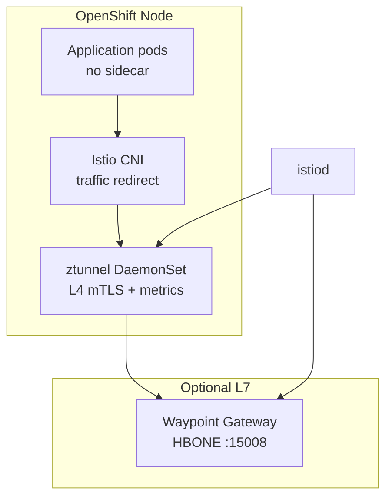

# OpenShift Service Mesh 3

**Git path:** `components/servicemeshoperator3/`
{: .fs-3 .text-grey-dk-000 }

Red Hat **OpenShift Service Mesh 3** (OSSM3) provides **ambient mesh** on OpenShift: a per-node **ztunnel** for L4 mTLS and telemetry, plus optional **waypoint** proxies for L7 policy.


{: .mb-4 }
*Kiali traffic graph and mesh topology in the OpenShift Console (OSSM plugin).*
{: .fs-2 .text-grey-dk-000 }

## Version and channel

| Channel | Version | ztunnel | Use |
| ------- | ------- | ------- | --- |
| `candidates` | 3.0.0-tp.2 | **No** | Tech Preview — do not use for production demos |
| **`stable-3.2`** | 3.2.x | **Yes** | **Recommended** for this platform (OCP 4.18–4.21) |

Subscription: `components/operators/templates/servicemeshoperator3.yaml` → `channel: stable-3.2`.

Mesh manifests: `components/servicemeshoperator3` (sync-wave 3 on hub and spokes via ApplicationSet).

## Ambient architecture



| Piece | Purpose |
| ----- | ------- |
| **ztunnel** | Per-node L4 proxy: mTLS, TCP metrics, ambient enrollment |
| **Waypoint** | Optional L7 Envoy for HTTP policy and `istio_requests_total` on meshed traffic |
| **Istio CNI** | Redirects pod traffic to ztunnel without sidecar injection |
| **Telemetry CR** | Enables Prometheus metric providers for the mesh |

## GitOps resources

The `servicemeshoperator3` chart deploys:

1. Namespaces: `istio-system`, `istio-cni`, `ztunnel`
2. `Istio` CR — `profile: ambient`, `trustedZtunnelNamespace: ztunnel`
3. `IstioCNI` CR — **`profile: ambient`** and `values.cni.ambient.reconcileIptablesOnStartup: true` (required for ztunnel socket and L4 metrics)
4. `ZTunnel` CR — must reach `Ready`; verify `oc get ds -n ztunnel`
5. Waypoint `Gateway` per mesh namespace (Industrial Edge, `hub-gateway-system`)
6. `Telemetry/mesh-default` in `istio-system`

```yaml
apiVersion: sailoperator.io/v1
kind: IstioCNI
metadata:
  name: default
spec:
  namespace: istio-cni
  profile: ambient
  values:
    cni:
      ambient:
        reconcileIptablesOnStartup: true
```

### Troubleshooting ztunnel (`ZTunnelNotHealthy`)

| Symptom | Cause | Fix |
| ------- | ----- | --- |
| ztunnel `0/N Ready`, log: `failed to connect ... ztunnel.sock` | `IstioCNI` without `profile: ambient` | Add `profile: ambient` to `IstioCNI` CR; CNI logs must show `AmbientEnabled: true` |
| No `istio_tcp_*` in Prometheus | ztunnel not Ready | Fix CNI first, confirm `PodMonitor` in `ztunnel` namespace |
| InstallPlan blocked on CRD v1alpha1 removal | TP2 → GA upgrade | Delete `Istio`/`IstioCNI` CRs and sailoperator CRDs, reinstall `stable-3.2` |

## Sync-wave ordering (ambient)

Ambient enrollment is **three phases** inside `components/servicemeshoperator3` (not `components/namespaces`):

| Phase | Sync wave | Resources |
| ----- | --------- | --------- |
| 1 | 0 | `istio-system`, `istio-cni`, `ztunnel` namespaces; **IstioCNI** (`profile: ambient`, `reconcileIptablesOnStartup: true`) |
| 2 | 1 | **Istio** + **ZTunnel** CRs (`Ready` before apps start) |
| 3 | 2 | `istio.io/dataplane-mode: ambient` on workload namespaces |
| 4 | 3 | Waypoint **Gateway** (HBONE `:15008`) where L7 policy is needed |

`reconcileIptablesOnStartup: true` repairs CNI rules on node restart but **does not** retro-configure pods that started before ztunnel — restart those workloads if you see `upstream connect error`. See [Troubleshooting](../troubleshooting.md#hbone-port-15008-not-configured).

Namespaces that stay **off mesh** (`components/namespaces`, no ambient label):

| Namespace | Mesh mode | Reason |
| --------- | --------- | ------ |
| `stackrox` | **none** (`istio.io/dataplane-mode: none`) | ACS Central ↔ PostgreSQL |
| `industrial-edge-data-lake` | **none** | MinIO / double-TLS patterns |

## Operator discovery

The Sail/Istio operator watches **`Istio`**, **`IstioCNI`**, **`ZTunnel`**, and **`Telemetry`** cluster/network namespaces (`istio-system`, `istio-cni`, `ztunnel`). Application workloads are enrolled **implicitly** by labeling namespaces **`istio.io/dataplane-mode: ambient`** (set via **`components/namespaces`**). Optionally declare waypoint **`Gateway`** resources where HTTP policy/L7 metrics matter — controllers reconcile those refs regardless of Deployment annotations.

## Metrics and dashboards

**Screenshots:** the Grafana gallery lives on **[Observability](../observability.md)** (four panels with click-to-zoom). Below is the metric cheat-sheet — keep Grafana UX details there to avoid duplicating captions here.

| Metric family | Source | When available |
| ------------- | ------ | -------------- |
| `istio_tcp_*` | ztunnel | After `IstioCNI` ambient profile + ztunnel Ready; non-zero only with traffic |
| `istio_requests_total` | Waypoints / ingress gateways | HTTP through waypoints or `hub-gateway-istio` |
| `kafka_server_kafkaserver_brokerstate` | Strimzi JMX | `3` = broker running |
| `kafka_network_requestmetrics_requestspersec_total` | Strimzi JMX | Reliable throughput signal for Grafana |
| `kafka_server_replicamanager_*` | Strimzi JMX | Leaders, partitions, under-replicated |

Scraping: `components/istio-monitoring` — PodMonitors for gateways/waypoints, ztunnel, Kafka; RoleBindings for UWM.

- Hub dashboards: `components/grafana-dashboards` — gauges, pie charts, bar gauges for Kafka; L4 bar gauge row on `multi-cluster-istio`
- Spoke dashboards: `components/spoke-dashboards` — `local-metrics` (ztunnel readiness gauge, Kafka bargauge/piechart, L4 timeseries)

Avoid Grafana queries on `kafka_server_brokertopicmetrics_*` with JMX `_objectname` filters — those series are not present in the current Strimzi scrape config.

## Kiali and OSSM Console

Deploy `Kiali` + `OSSMConsole` via `components/kiali` on hub and spokes. The console plugin requires:

- `ClusterRoleBinding` → `cluster-monitoring-view` for `kiali-service-account`
- `prometheus.auth.use_kiali_token: true` and `thanos_proxy.enabled: true`

Without ztunnel (TP2), Kiali shows topology but **no traffic graph**.

## Multi-cluster considerations

- Install the same OSSM3 channel on hub and all spokes.
- Hub gateway routes HTTP to spoke Routes (port 80, `ServiceEntry`, Host header rewrite) — see [Hub Gateway](../hub-gateway.md).
- Cross-cluster mesh metrics on hub Grafana use Skupper-exported Prometheus — see [Observability](../observability.md).

## Documentation

- [OpenShift Service Mesh 3.2 — ambient mode](https://docs.redhat.com/en/documentation/red_hat_openshift_service_mesh/3.2/html/installing/ossm-istio-ambient-mode)
- [Kiali Operator (OSSM 3.2)](https://docs.redhat.com/en/documentation/red_hat_openshift_service_mesh/3.2/html/observability/kiali-operator-provided-by-red-hat)

Charts: `components/servicemeshoperator3`, `components/istio-monitoring`, `components/kiali`, `components/hub-gateway`, `components/spoke-gateway`.
