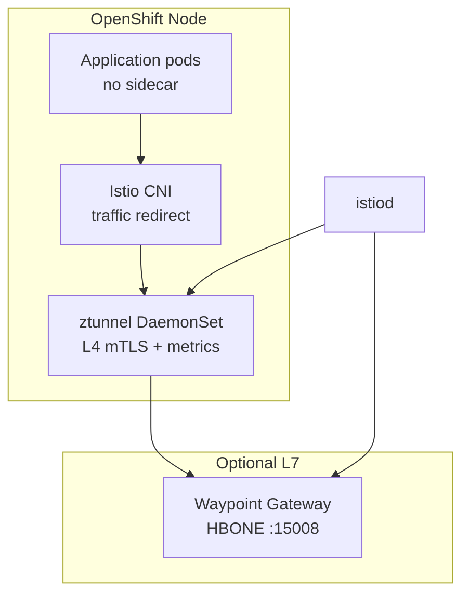

# OpenShift Service Mesh 3

Red Hat **OpenShift Service Mesh 3** (OSSM3) provides **ambient mesh** on OpenShift: a per-node **ztunnel** for L4 mTLS and telemetry, plus optional **waypoint** proxies for L7 policy.

## Version and channel

| Channel | Version | ztunnel | Use |
| ------- | ------- | ------- | --- |
| `candidates` | 3.0.0-tp.2 | **No** | Tech Preview — do not use for production demos |
| **`stable-3.2`** | 3.2.x | **Yes** | **Recommended** for this platform (OCP 4.18–4.21) |

Subscription: `components/operators/templates/servicemeshoperator3.yaml` → `channel: stable-3.2`.

Mesh manifests: `components/servicemeshoperator3` (sync-wave 3 on hub and spokes via ApplicationSet).

## Ambient architecture

| Piece | Purpose |
| ----- | ------- |
| **ztunnel** | Per-node L4 proxy: mTLS, TCP metrics, ambient enrollment |
| **Waypoint** | Optional L7 Envoy for HTTP policy and `istio_requests_total` on meshed traffic |
| **Istio CNI** | Redirects pod traffic to ztunnel without sidecar injection |
| **Telemetry CR** | Enables Prometheus metric providers for the mesh |

## GitOps resources

The `servicemeshoperator3` chart deploys:

1. Namespaces: `istio-system`, `istio-cni`, `ztunnel`
2. `Istio` CR — `profile: ambient`, `trustedZtunnelNamespace: ztunnel`
3. `IstioCNI` CR
4. `ZTunnel` CR — must reach `Ready`; verify `oc get ds -n ztunnel`
5. Waypoint `Gateway` per mesh namespace (Industrial Edge, `hub-gateway-system`)
6. `Telemetry/mesh-default` in `istio-system`

Namespaces receive `istio.io/dataplane-mode: ambient` via `components/namespaces`.

## Metrics and dashboards

| Metric family | Source | When available |
| ------------- | ------ | -------------- |
| `istio_tcp_*` | ztunnel | Ambient-enrolled namespaces with traffic |
| `istio_requests_total` | Waypoints / ingress gateways | HTTP through waypoints or `hub-gateway-istio` |
| Kafka JMX | Strimzi PodMonitor | User Workload Monitoring enabled on spokes |

Scraping: `components/istio-monitoring` — PodMonitors for gateways/waypoints, ztunnel, Kafka; RoleBindings for UWM.

- Hub dashboards: `components/grafana-dashboards` (`east-west-traffic`, `multi-cluster-istio`)
- Spoke dashboards: `components/spoke-dashboards` (`local-metrics` — L4 + Kafka panels)

## Kiali and OSSM Console

Deploy `Kiali` + `OSSMConsole` via `components/kiali` on hub and spokes. The console plugin requires:

- `ClusterRoleBinding` → `cluster-monitoring-view` for `kiali-service-account`
- `prometheus.auth.use_kiali_token: true` and `thanos_proxy.enabled: true`

Without ztunnel (TP2), Kiali shows topology but **no traffic graph**.

## Multi-cluster considerations

- Install the same OSSM3 channel on hub and all spokes.
- Hub gateway routes HTTP to spoke Routes (port 80, `ServiceEntry`, Host header rewrite) — see [Hub Gateway](../hub-gateway.md).
- Cross-cluster mesh metrics on hub Grafana use Skupper-exported Prometheus — see [Observability](../observability.md).

## Documentation

- [OpenShift Service Mesh 3.2 — ambient mode](https://docs.redhat.com/en/documentation/red_hat_openshift_service_mesh/3.2/html/installing/ossm-istio-ambient-mode)
- [Kiali Operator (OSSM 3.2)](https://docs.redhat.com/en/documentation/red_hat_openshift_service_mesh/3.2/html/observability/kiali-operator-provided-by-red-hat)

Charts: `components/servicemeshoperator3`, `components/istio-monitoring`, `components/kiali`, `components/hub-gateway`, `components/spoke-gateway`.
