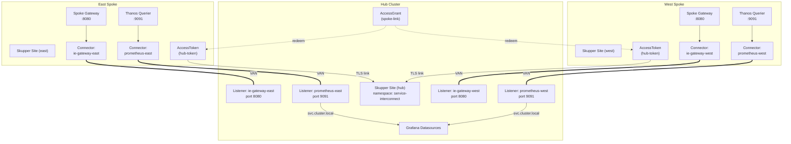
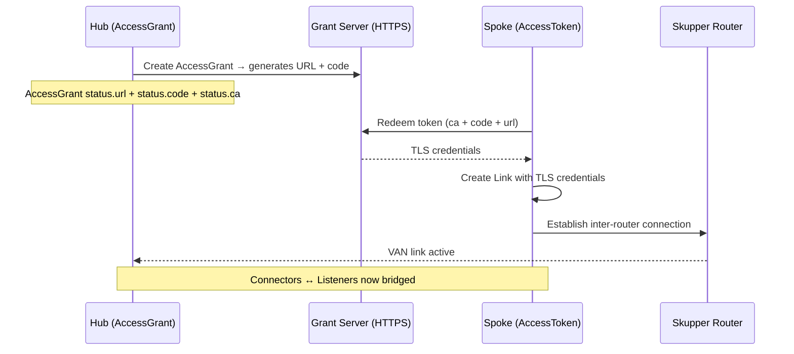
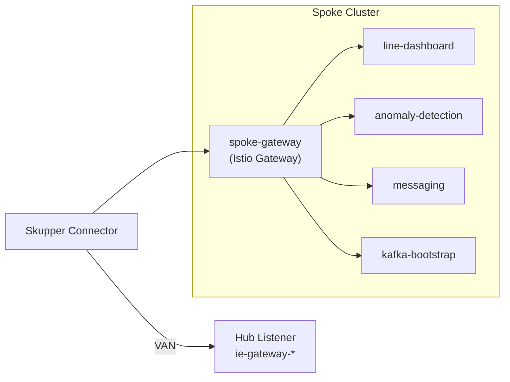

# Service Interconnect (Skupper)

**Red Hat Service Interconnect** creates a Virtual Application Network (VAN) that connects services across clusters without requiring VPN tunnels, direct network routes, or firewall changes. In this platform, Skupper bridges spoke Industrial Edge services and Prometheus metrics to the hub for centralized observability.

## Architecture

## Link establishment flow

The Skupper link between spoke and hub requires an **AccessToken** that is created from the hub's **AccessGrant**:

## Components

### Hub (`components/service-interconnect`)

| Resource | Purpose |
| -------- | ------- |
| `Site/hub` | Declares the hub as a Skupper site |
| `AccessGrant/spoke-link` | Generates claim tokens for spoke connections |
| `Listener/ie-gateway-east` | Receives spoke-gateway traffic from east |
| `Listener/ie-gateway-west` | Receives spoke-gateway traffic from west |
| `Listener/prometheus-east` | Receives Prometheus metrics from east |
| `Listener/prometheus-west` | Receives Prometheus metrics from west |

### Spoke (`components/spoke-interconnect`)

| Resource | Purpose |
| -------- | ------- |
| `Namespace/service-interconnect` | Skupper workspace |
| `Site/<clusterName>` | Declares the spoke as a Skupper site |
| `Connector/ie-gateway-<cluster>` | Exposes local spoke-gateway to hub |
| `Connector/prometheus-<cluster>` | Exposes local Thanos Querier to hub |

The `AccessToken` is created manually via `ManagedClusterAction` since it contains sensitive claim data that should not be stored in Git.

## Spoke gateway aggregation

Rather than exposing each Industrial Edge service individually, each spoke runs a **Gateway API gateway** (`components/spoke-gateway`) that aggregates all services behind a single entry point. Skupper exposes only this gateway to the hub.

## Operator deployment

The `skupper-operator` subscription is deployed to spokes via the `operators` component in the ApplicationSet `valuesObject`. This ensures the CRDs are available before Skupper CRs are applied.

## References

- [Red Hat Service Interconnect 2.1](https://docs.redhat.com/en/documentation/red_hat_service_interconnect/2.1)
- [Skupper v2 API](https://skupper.io/docs/)

Charts: `components/service-interconnect` (hub), `components/spoke-interconnect` (spokes), `components/spoke-gateway` (spokes).
