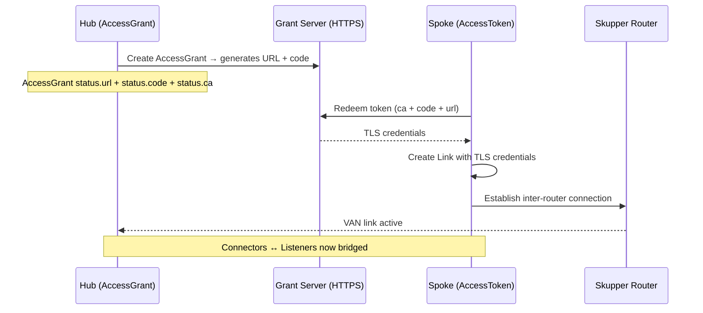
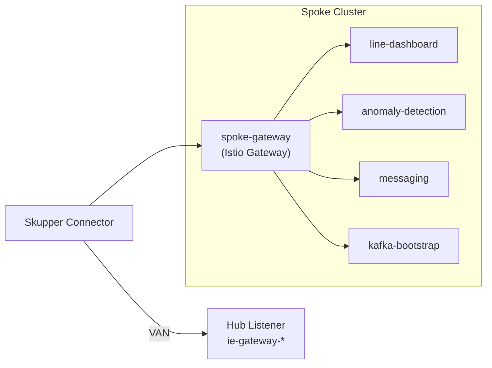

# Service Interconnect (Skupper)

**Git path:** `components/service-interconnect/`
{: .fs-3 .text-grey-dk-000 }

**Red Hat Service Interconnect** creates a Virtual Application Network (VAN) that connects services across clusters without requiring VPN tunnels, direct network routes, or firewall changes. In this platform, Skupper bridges spoke Industrial Edge services and Prometheus metrics to the hub for centralized observability.

The diagram below shows **listeners and connectors** only. For Kafka Console screenshots and broker DNS details, see **[AMQ Streams](products/amq-streams.md)** and **[Observability — Kafka Console](observability.md#kafka-console-hub)** (same topic, split so Skupper stays focused on VAN mechanics).

## Architecture

```mermaid
flowchart TB
  subgraph Hub["Hub Cluster"]
    direction TB
    SITE_H["Skupper Site (hub)<br/>namespace: service-interconnect"]
    AG["AccessGrant<br/>(spoke-link)"]
    L_GW_E["Listener: ie-gateway-east<br/>port 8080"]
    L_GW_W["Listener: ie-gateway-west<br/>port 8080"]
    L_PM_E["Listener: prometheus-east<br/>port 9091"]
    L_PM_W["Listener: prometheus-west<br/>port 9091"]
    L_K_E["Listener: kafka-east-tst<br/>port 9092"]
    L_K_W["Listener: kafka-west-tst<br/>port 9092"]
    GRAFANA["Grafana Datasources"]
    KAFKA_C["Kafka Console"]
    L_PM_E -->|"svc.cluster.local"| GRAFANA
    L_PM_W -->|"svc.cluster.local"| GRAFANA
  end

  subgraph East["East Spoke"]
    SITE_E["Skupper Site (east)"]
    TOKEN_E["AccessToken<br/>(hub-token)"]
    CONN_GW_E["Connector:<br/>ie-gateway-east"]
    CONN_PM_E["Connector:<br/>prometheus-east"]
    CONN_K_E["Connector:<br/>kafka-east-tst"]
    SGW_E["Spoke Gateway<br/>:8080"]
    TQ_E["Thanos Querier<br/>:9091"]
    KAFKA_E["Kafka bootstrap<br/>:9092"]
    SGW_E --> CONN_GW_E
    TQ_E --> CONN_PM_E
    KAFKA_E --> CONN_K_E
  end

  subgraph West["West Spoke"]
    SITE_W["Skupper Site (west)"]
    TOKEN_W["AccessToken<br/>(hub-token)"]
    CONN_GW_W["Connector:<br/>ie-gateway-west"]
    CONN_PM_W["Connector:<br/>prometheus-west"]
    CONN_K_W["Connector:<br/>kafka-west-tst"]
    SGW_W["Spoke Gateway<br/>:8080"]
    TQ_W["Thanos Querier<br/>:9091"]
    KAFKA_W["Kafka bootstrap<br/>:9092"]
    SGW_W --> CONN_GW_W
    TQ_W --> CONN_PM_W
    KAFKA_W --> CONN_K_W
  end

  AG -.->|"redeem"| TOKEN_E
  AG -.->|"redeem"| TOKEN_W
  TOKEN_E -->|"TLS link"| SITE_H
  TOKEN_W -->|"TLS link"| SITE_H
  CONN_GW_E ===|"VAN"| L_GW_E
  CONN_PM_E ===|"VAN"| L_PM_E
  CONN_GW_W ===|"VAN"| L_GW_W
  CONN_PM_W ===|"VAN"| L_PM_W
  CONN_K_E ===|"VAN"| L_K_E
  CONN_K_W ===|"VAN"| L_K_W
  L_K_E --> KAFKA_C
  L_K_W --> KAFKA_C
```



## Link establishment flow

The Skupper link between spoke and hub requires an **AccessToken** that is created from the hub's **AccessGrant**:



## Components

### Hub (`components/service-interconnect`)

| Resource | Purpose |
| -------- | ------- |
| `Site/hub` | Declares the hub as a Skupper site |
| `AccessGrant/spoke-link` | Generates claim tokens for spoke connections |
| `Listener/ie-gateway-east` | Receives spoke-gateway traffic from east |
| `Listener/ie-gateway-west` | Receives spoke-gateway traffic from west |
| `Listener/prometheus-east` | Receives Prometheus metrics from east |
| `Listener/prometheus-west` | Receives Prometheus metrics from west |
| `Listener/kafka-east-tst` | Kafka bootstrap (dev-cluster) from east |
| `Listener/kafka-west-tst` | Kafka bootstrap (dev-cluster) from west |
| `Listener/kafka-east-stormshift` | Kafka bootstrap (factory-cluster) from east |
| `Listener/kafka-west-stormshift` | Kafka bootstrap (factory-cluster) from west |

### Spoke (`components/spoke-interconnect`)

| Resource | Purpose |
| -------- | ------- |
| `Namespace/service-interconnect` | Skupper workspace |
| `Site/<clusterName>` | Declares the spoke as a Skupper site |
| `Connector/ie-gateway-<cluster>` | Exposes local spoke-gateway to hub |
| `Connector/prometheus-<cluster>` | Exposes auth proxy → Thanos Querier to hub |
| `Connector/kafka-<cluster>-tst` | Exposes `dev-cluster-kafka-bootstrap` to hub |
| `Connector/kafka-<cluster>-stormshift` | Exposes `factory-cluster-kafka-bootstrap` to hub |

The `AccessToken` is created manually via `ManagedClusterAction` since it contains sensitive claim data that should not be stored in Git.

### AccessToken CA certificate

The Skupper grant server uses **passthrough TLS termination** on its OpenShift Route, presenting a self-signed certificate from `SkupperGrantServerCA` -- **not** the OpenShift Ingress CA.

Extract the correct CA from the hub:

```bash
oc get secret skupper-grant-server-ca -n openshift-operators \
  -o jsonpath='{.data.ca\.crt}' | base64 -d
```

Using the wrong CA (e.g. OpenShift Ingress CA) causes `x509: certificate signed by unknown authority` when the spoke tries to redeem the token.

## Kafka bootstrap over Skupper

Skupper forwards **TCP** to Kafka bootstrap (`:9092`). Hub **Kafka Console** and other hub clients use listener hostnames in `service-interconnect`:

```yaml
# Hub listeners (components/service-interconnect) — ebook Ch.6 / Ch.12 alignment
# kafka-east-tst:9092       → dev-cluster bootstrap (east)
# kafka-east-stormshift:9092 → factory-cluster bootstrap (east)
# kafka-east-datalake:9092   → prod-cluster bootstrap (east)
# kafka-west-tst:9092        → dev-cluster bootstrap (west)
# kafka-west-stormshift:9092 → factory-cluster bootstrap (west)
# kafka-west-datalake:9092   → prod-cluster bootstrap (west)
```

Console CR (`components/kafka-console`) references these services:

```yaml
spec:
  kafkaClusters:
    - name: dev-cluster-east
      properties:
        values:
          - name: bootstrap.servers
            value: kafka-east-tst.service-interconnect.svc.cluster.local:9092
```

Clients then receive broker metadata with spoke-internal DNS names that **do not resolve on the hub** until you add hub-side **`EndpointSlice`** mappings and matching Strimzi **advertisedHost** on spokes.

Step-by-step and screenshots: **[Observability → Kafka Console](observability.md#kafka-console-hub)**. External `/api` routing: **[Troubleshooting → Kafka Console 404](troubleshooting.md#kafka-console-404-on-api)**.

## Spoke gateway aggregation

Rather than exposing each Industrial Edge service individually, each spoke runs a **Gateway API gateway** (`components/spoke-gateway`) that aggregates all services behind a single entry point. Skupper exposes only this gateway to the hub.



## Network Console (Skupper GUI)

The Skupper Network Observer provides a web console to visualize the service interconnect topology, traffic flow, and process-level communication across clusters.


{: .mb-4 }
*Sites view showing the hub, east, and west clusters linked via the Virtual Application Network.*
{: .fs-2 .text-grey-dk-000 }


{: .mb-4 }
*Components view with listeners and connectors bridging services across clusters.*
{: .fs-2 .text-grey-dk-000 }


{: .mb-4 }
*Process-level topology showing individual workloads and their cross-cluster connections.*
{: .fs-2 .text-grey-dk-000 }


{: .mb-4 }
*Process detail panel with connection metadata and traffic direction.*
{: .fs-2 .text-grey-dk-000 }


{: .mb-4 }
*Built-in metrics view with Prometheus data for TCP bytes, latency, and connection counts.*
{: .fs-2 .text-grey-dk-000 }

### Deployment notes

The Network Observer is deployed via the official OCI Helm chart (`oci://quay.io/skupper/helm/network-observer`). Key configuration:

- **`auth.strategy: none`** — no OAuth proxy, direct access
- **`tls.openshiftIssued: true`** — uses OpenShift service serving certificates (trusted by the router for `reencrypt` TLS)
- **`tls.skupperIssued: false`** — prevents Skupper from overwriting the TLS secret with its own CA (which the router does not trust, causing 503)
- **`route.enabled: true`** — creates an OpenShift Route for external access

## Operator deployment

The `skupper-operator` subscription is deployed to spokes via the `operators` component in the ApplicationSet `valuesObject`. This ensures the CRDs are available before Skupper CRs are applied.

## Operator discovery

Skupper controllers reconcile **`Site`**, **`AccessGrant`**, **`AccessToken`**, **`Link`**, **`Listener`**, and **`Connector`** CRs (`skupper.io` / Skupper v2 APIs). Spokes expose workloads by targeting **`spec.routingKey`** / connector selectors — **Kubernetes Deployments do not need Skupper annotations** for discovery (CR linking wires listeners ↔ connectors).

Tokens (`AccessToken`) bridge clusters via HTTPS grant servers — rotate manually when recycling demo clusters.

## References

- [Red Hat Service Interconnect 2.1](https://docs.redhat.com/en/documentation/red_hat_service_interconnect/2.1)
- [Skupper v2 API](https://skupper.io/docs/)

Charts: `components/service-interconnect` (hub), `components/spoke-interconnect` (spokes), `components/spoke-gateway` (spokes).
